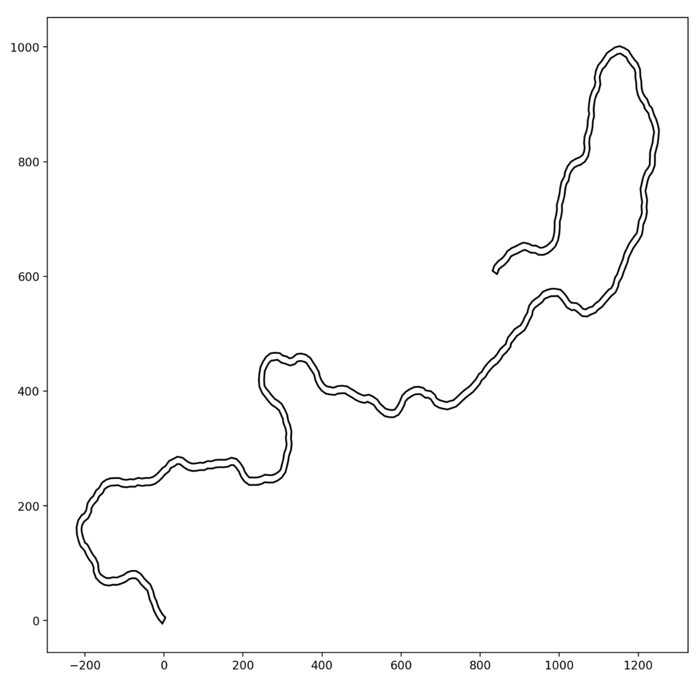
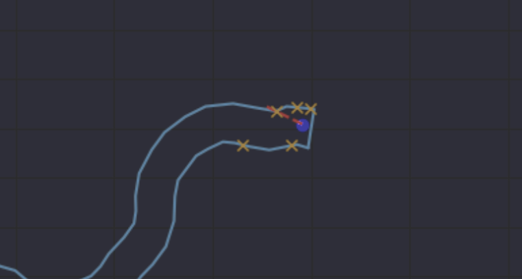
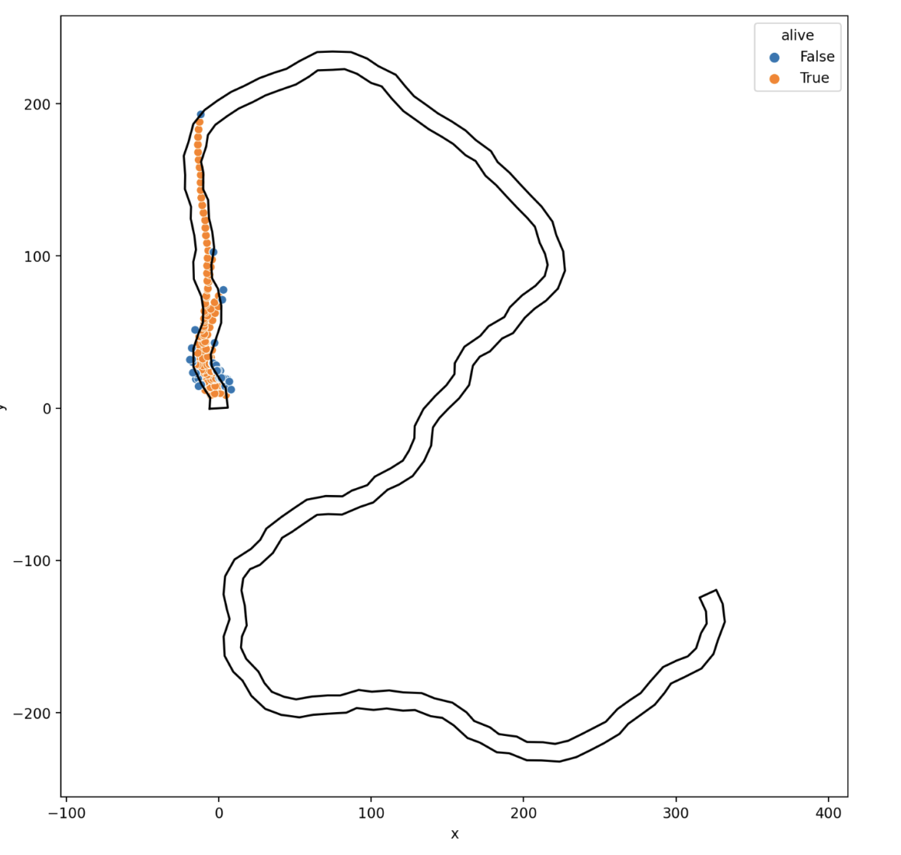
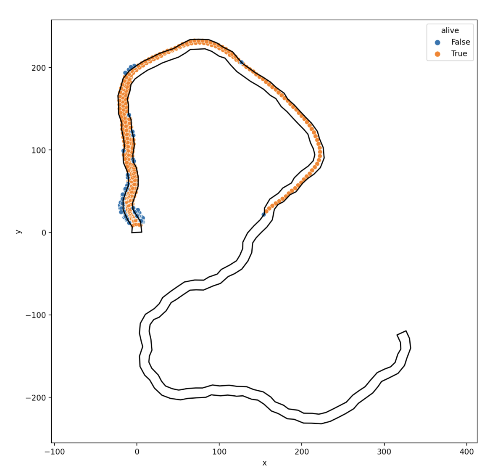
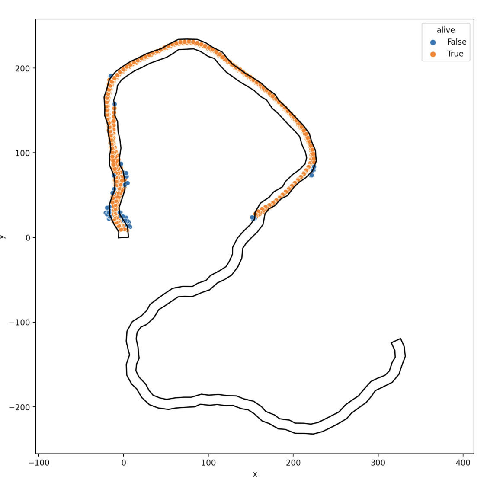
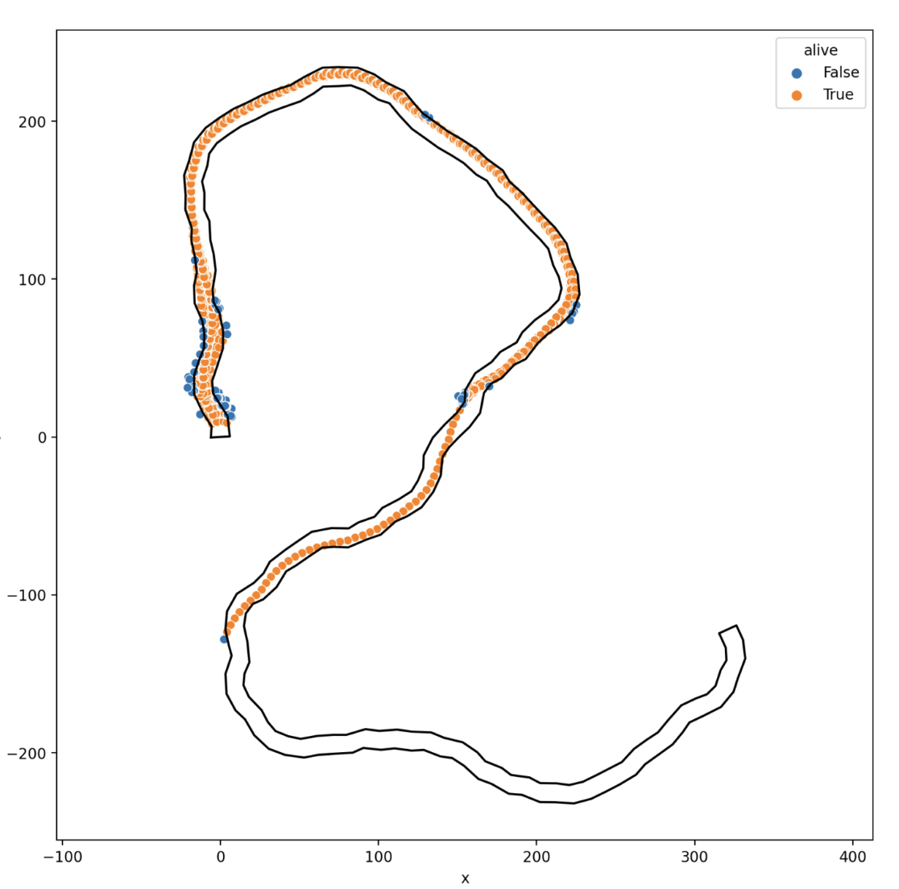
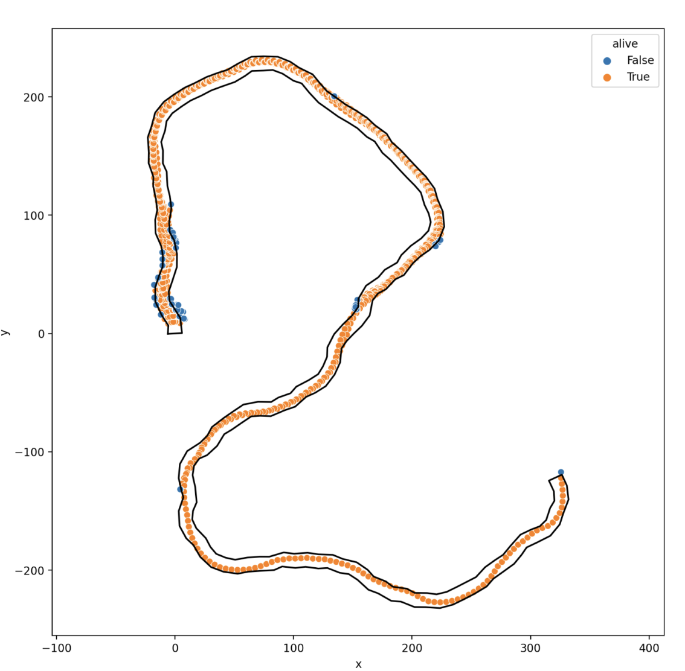

# bcg-NN-genetic-cars
Repo for Kamil Benkirane's BCG Mindfuel about Self driving cars using Neural Networks trained by genetic algorithms

## Environment
In this project we are using python 3.8, to create environment using conda with the packages requirements, run:
```bash
conda create --name <env> python=3.8 --file requirements.txt
``` 

## Run
To run the project, run:
```bash
streamlit run app.py
```

# Project Overview
In this project I wanted to explore different topics, neural networks, genetic algorighms and self driving cars.
Because of the short timeframe I decided to use a simple approach like this.
I hope you'll enjoy it.

## Environment
The environment consist of a 2D route and a number of cars.
Each car runs the route and tries to get as far as possible.
At the end of the race the 10 best cars are selected, modified a little bit in order to create a new generation of cars.
This process is repeated until the cars are able to finish the route.

## Route
The route is a 2D map with a start and finish line.
It is defined by a number of points generated randomly
We start with a initial point at position (0,0) and we add a new point at a distance of 1 and a random angle until we reach the number of points.
The route is then drawn using the points.


## Car
The car is a simple object with a position, a direction and a speed.
The car has 5 antennas that are used to detect the distance to the edges of the route.
The antennas are placed at the front, left, right, left front and right front of the car.  

The 5 distances from the car to the edges of the route are used as input for the neural network.
The output of the neural network is the angle from the current car angle to turn the car.
The car is then moved forward by the speed and the angle is applied. 
The speed is fixed.

## Mutation
At the end of the race, the 10 best cars are selected and modified a little bit in order to create a new generation of cars.
The 10 best cars are selected based on the distance they were able to drive.
Those 10 cars will remain identical for the next generation.
And for each of the (assuming a generation of 100 cars), 9 children will be created.
each children will have one neuron, randomly selected, from any of the layers, that will be modified. 

## Results
### Generation 0
At generation 0, the last carz get stuck at the first turn.
[generation_0_run.html](images/generation_0_run.html)
### Generation 1
At generation 1, the last car get stuck midway.
[generation_1_run.html](images/generation_1_run.html)

### Generation 5
At generation 5 more cars get to that step.
[generation_5_run.html](images/generation_5_run.html)

### Generation 18
At generation 18, one car is able to get past that stuck point.

[generation_18_run.html](images/generation_18_run.html)

### Generation 23
At generation 23, one car is able to finish the route.

[generation_23_run.html](images/generation_23_run.html)


